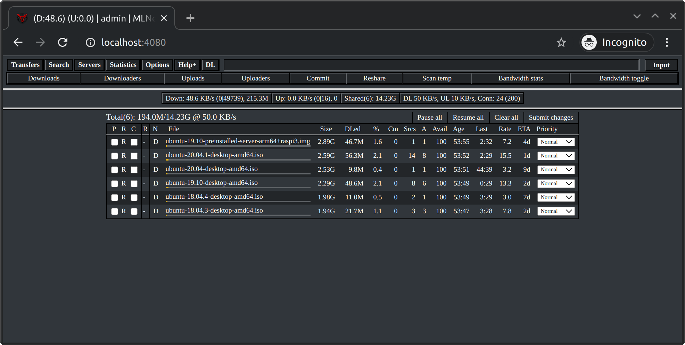

# What is this?
This is my first time using Github so don't get too upset if I've done something wrong :)

I've only created this branch to share my docker-compse.yml and .env files in order to help the people who want to use this awesome image using docker compose.

From this point, is the original readme.md

# mldonkey docker image

This repository hosts the Dockerfile for building the mldonkey docker image.

This image includes:

* mldonkey core from the [official mldonkey repo](https://github.com/ygrek/mldonkey);
* additional patches from my [mldonkey fork](https://github.com/carlonluca/mldonkey);
* [mldonkey-next](https://github.com/carlonluca/mldonkey-next), a modern web client for mldonkey written in Angular (see the [official repo](https://github.com/carlonluca/mldonkey-next) for other native clients).



Desktop             |  Mobile
:-------------------------:|:-------------------------:
  |  

## Available versions

Versions tagged just with a software versions are builds of mldonkey from official mldonkey releases. The mldonkey code is currently taken from https://github.com/ygrek/mldonkey.

Versions including a hash are versions built from specific commits. Commits do not refer to the official repo but to my fork https://github.com/carlonluca/mldonkey. If you want to know what the image includes, refer to that repo history and branches (in particular the dev branch). My fork tries to stay in sync with the more official repo above.

Currently, dev images include the dark theme and all the most recent commits to the official repo + other updates. Refer to https://github.com/carlonluca/mldonkey for more info.

**Refer to https://bugfreeblog.duckdns.org/docker-images-for-the-mldonkey-service for more info about each available image.**

## Owner and permissions

The mldonkey daemon running inside the container must be able to read and modify
data inside the volume. You'll also probably want to properly share data with a
user available in your host. The mldonkey daemon always use the **mldonkey** user and
group, but you can setup the environment so that the container assignes the desired
uid and gid to the mldonkey user and group inside the container. This will allow you
to see those files with the proper permissions in your host.

### Example

Let's assume your user is named _luca_ and has the uid 1001, and that you want your
data to be assigned group _luca_, which has the same gid 1001. In this case you
can ask the container to assign the value 1001 to uid and gid _mldonkey_ in the container
by using the env variables:

```
MLDONKEY_UID=1001
MLDONKEY_GID=1001
```

This will establish a mapping between user _luca_ in the host to user _mldonkey_ in the
container, and group _luca_ in the host with group _mldonkey_ in the container.

## Ports

|Network|Type|MLDonkey default|Configuration file|
|---|---|---|---|
|http_port|HTTP|4080|downloads.ini|
|mldonkey-next interface|HTTP|4081|container remap<br/>(required for mldonkey-next)|
|telnet_port|TCP|4000|downloads.ini|
|gui_port|TCP|4001|downloads.ini|
|websocket to core|TCP|4002|container remap<br/>(required for mldonkey-next)|
|websocket for log stream|TCP|4003|container remap<br/>(<b>WARNING: no authentication</b>)|
|eDonkey2000|TCP|random|donkey.ini|
|eDonkey2000|UDP|TCP port + 4|donkey.ini|
|Kad|TCP|random|donkey.ini, Kademlia section|
|Kad1|UDP|Same as TCP|donkey.ini, Kademlia section|
|Overnet|TCP|random|donkey.ini, Overnet section|
|Overnet|UDP|Same as TCP|donkey.ini, Overnet section|
|BitTorrent Client |TCP|6882|bittorrent.ini|
|BitTorrent Tracker |TCP|6881|bittorrent.ini|
|BitTorrent DHT |UDP|random|bittorrent.ini|
|DirectConnect|TCP|4444|directconnect.ini|
|DirectConnect|UDP|Same as TCP|directconnect.ini|

## Running the Container

To run mldonkey using this image:

```
$ docker run -i -t carlonluca/mldonkey
```

You may change the admin password by using the comand `useradd admin <password`,
or you can specify `MLDONKEY_ADMIN_PASSWORD` environment variable with
a password:

```
$ docker run -i -t -e MLDONKEY_ADMIN_PASSWORD=supersecret carlonluca/mldonkey
```

mldonkey stores data inside `/var/lib/mldonkey`. You may want to mount the
data directory to local filesystem. Doing this will persist the data
when you re-create the docker container. It is also easier to get downloaded
files this way.

```
$ docker run -i -t -v "`pwd`/data:/var/lib/mldonkey" carlonluca/mldonkey
```

Your data will be available under `data/incoming` directory where you
run the `docker run` command.

You'll probably also want to map some ports to be able to access the daemon. For example:

```
docker create --name=mldonkey \ 
              -v <path to core files>:/var/lib/mldonkey:rw \
              -e MLDONKEY_GID=<gid> \
              -e MLDONKEY_UID=<uid> \
              -e TZ=<timezone> \
              -e MLDONKEY_ADMIN_PASSWORD=password \
              -p 4000:4000 \
              -p 4001:4001 \
              -p 4002:4002 \
              -p 4080:4080 \
              -p 4081:4081 \
              -p <edonkey_port>:<edonkey_port> \
              -p <edonkey_port>:<edonkey_port>/udp \
              -p <kad>:<kad> \
              -p <kad>:<kad>/udp \
              -p <overnet>:<overnet> \
              -p <overnet>:<overnet>/udp \
              -p 6881:6881 \
              -p 6882:6882 \
              -p 3617:3617/udp \
              -p 4444:4444 \
              -p 4444:4444/udp \
              carlonluca/mldonkey:dev
```

NOTE: for the randomly chosen ports, you'll have to run the container first and let the core create his conf files. Then create the container again by remapping the chosen ports.

## Notes for Docker for Mac

mldonkey does not like the `temp` directory to reside in Mac filesystem. It is
better to mount `/var/lib/mldonkey/temp` inside the Docker VM filesystem.
